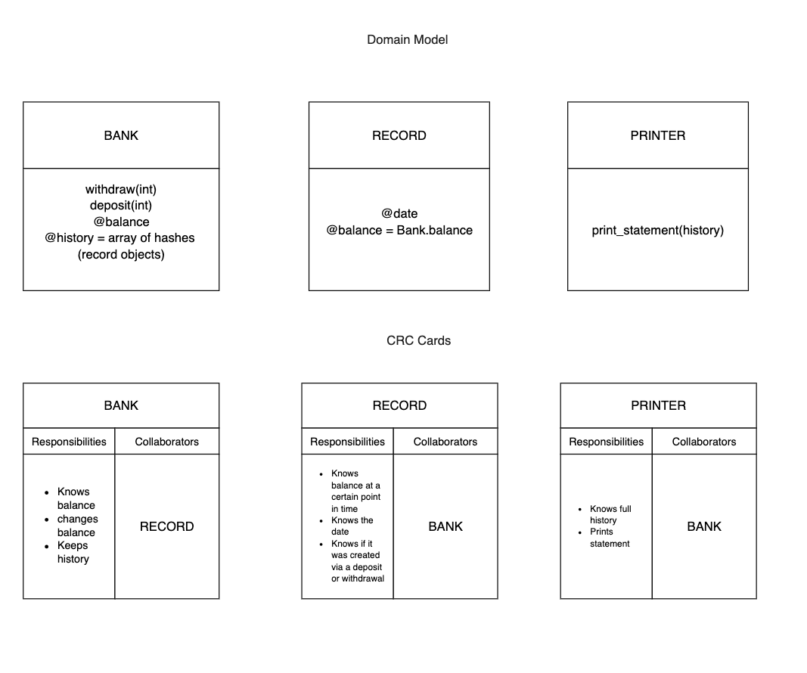

# Bank Tech Test

This is a command line application that allows a user to make deposits and withdrawals to their account. It returns a bank statement that shows the user a history of their transactions and a record of when those transactions were made. You cannot deposit more than the limit of 20,000.00 and you cannot withdraw an amount that would take the balance below 0.00.

### How to run

1. Clone the repo to your local machine
2. Run ```bundle install``` to install the required gems
3. Open the irb REPL in your terminal (irb) and enter the below:

Example Input:

```
% require './lib/bank'
% bank = Bank.new
% bank.deposit(400)
% bank.withdraw(150)
% bank.print_statement

```
Example Output:

```
date        || credit || debit  || balance
01/09/2021  || 400.00 || 0.00   || 400.00
01/09/2021  || 0.00   || 150.00 || 250.00 

```

### How to test

1. Once you have run 'bundle install', run ```rspec``` in your terminal to run the test suite.

### Approach

This project was completed using a TDD approach. I made sure to not write any code unless I had written a failing test for it first.
I then passed that test with the simplest code I could and refactored if necessary.

I started by making sure that the balance started at 0 and could not go above/below set amounts. I then made sure deposit and withdrawal methods were working correctly before moving on to the next phase which was adding the record to a history when a deposit or withdrawal was made.

This was achieved by creating a Record class that received information from the Bank class. I tested this class independantly to ensure my tests were decoupled. I then moved on to mocking the new class in my Bank class tests. The same approach was then used for the printer class.

There should be 100% test coverage.

### Improvements

- I was unsure whether it was worth adding a method in the Record class to format each instance variable prior to it being inserted into the history array.

- It might be nice to present some feedback to the user that their deposit/withdrawal was successful rather than the terminal output.

- It may be an idea to use a gem such as [terminal table](https://github.com/tj/terminal-table) to format the output properly.

I have diagrammed my thought process below:




